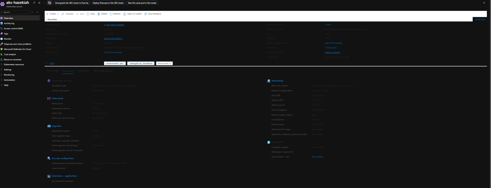
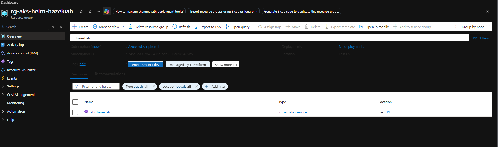
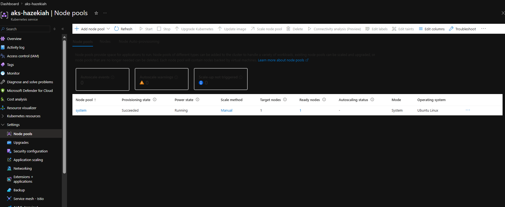
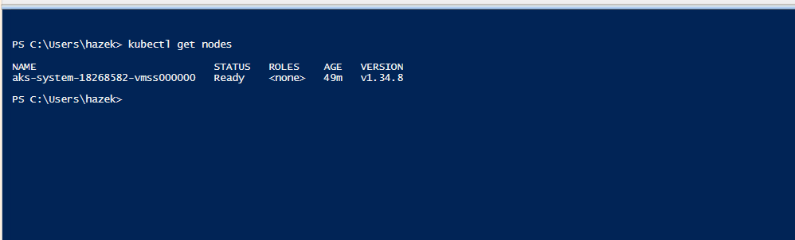
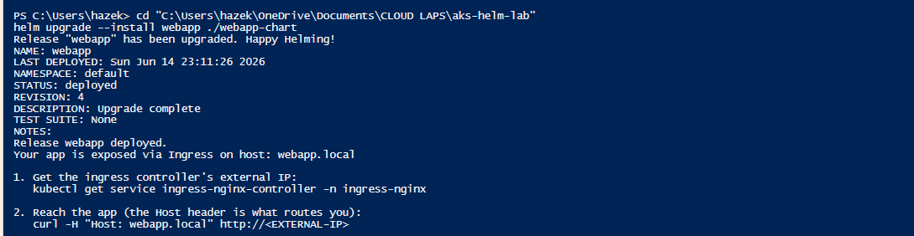
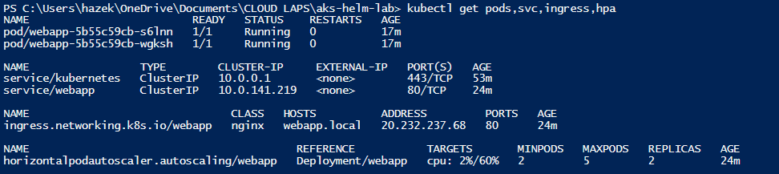
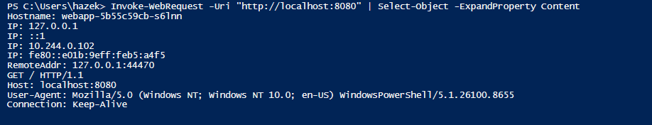
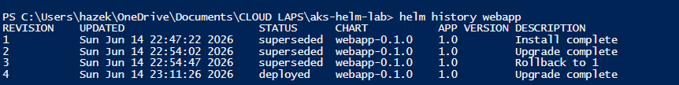
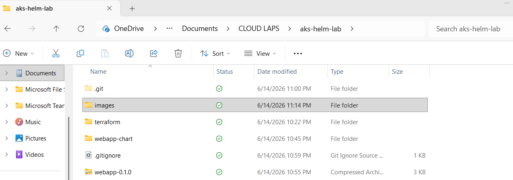

# Deploying to AKS with Helm



## What This Lab Builds

A managed Kubernetes cluster on Azure (AKS) provisioned with Terraform, and a full Helm chart that packages a real web application — its Deployment, Service, Ingress, ConfigMap, Secret, health probes, resource limits, and autoscaler — into one versioned, parameterized unit that can be installed, upgraded, and rolled back with a single command.

## Business Problem Solved

When apps run across multiple environments (dev, staging, prod), environments drift. Someone changes a replica count here, edits a YAML file directly in production there, and nobody can reproduce a deployment or roll back reliably.

Helm fixes this. It packages an application and every Kubernetes object it needs into a single versioned chart. The only thing that changes between environments is a values file. Upgrades and rollbacks happen to the entire release at once, as one tracked unit.

---

## Architecture

```
aks-helm-lab/
├── terraform/                        → provisions the cluster
│   ├── main.tf
│   ├── variables.tf
│   ├── outputs.tf
│   └── terraform.tfvars              → excluded from git
│
└── webapp-chart/                     → the application, packaged
    ├── Chart.yaml
    ├── values.yaml
    ├── .helmignore
    └── templates/
        ├── _helpers.tpl
        ├── deployment.yaml
        ├── service.yaml
        ├── ingress.yaml
        ├── configmap.yaml
        ├── secret.yaml
        ├── hpa.yaml
        └── NOTES.txt
```

**Cluster add-on:** ingress-nginx (installed via Helm) provides the ingress controller and Azure load balancer.

---

## Tools Used

| Tool | Purpose |
|---|---|
| Terraform | Provisions AKS cluster and resource group |
| Azure CLI | Authentication and kubeconfig setup |
| kubectl | Communicates with the Kubernetes cluster |
| Helm | Packages, installs, upgrades, and rolls back the app |

---

## Prerequisites

- Azure CLI installed and logged in (`az login`)
- Terraform installed
- kubectl installed
- Helm installed

---

## Part A — Provision AKS with Terraform

### Step A1 — Create folder structure

```powershell
mkdir aks-helm-lab
cd aks-helm-lab
mkdir terraform
mkdir webapp-chart\templates
```

### Step A2 — Write variables.tf

```hcl
variable "yourname" {
  description = "Your name, lowercase, no spaces."
  type        = string
}

variable "location" {
  type    = string
  default = "East US"
}

variable "node_count" {
  type    = number
  default = 2
}

variable "vm_size" {
  type    = string
  default = "Standard_B2s"
}

variable "tags" {
  type = map(string)
  default = {
    project     = "aks-helm"
    environment = "dev"
    managed_by  = "terraform"
  }
}
```

### Step A3 — Write terraform.tfvars

```hcl
yourname   = "hazekiah"
location   = "East US"
vm_size    = "Standard_D2s_v3"
node_count = 1
```

> **Note:** `terraform.tfvars` is excluded from git. Check your subscription's available VM sizes with:
> `az vm list-skus --location eastus --resource-type virtualMachines --output table`

### Step A4 — Write main.tf

Provisions the resource group and AKS cluster. Uses `SystemAssigned` managed identity so the cluster can create Azure resources (like the load balancer) on your behalf. `sku_tier = "Free"` keeps the managed control plane free — you only pay for worker nodes.

### Step A5 — Write outputs.tf

Outputs the resource group name, cluster name, and the exact `az aks get-credentials` command to connect kubectl after apply.

### Step A6 — Deploy

```powershell
$env:ARM_SUBSCRIPTION_ID = (az account show --query id -o tsv)
cd terraform
terraform init
terraform plan
terraform apply -auto-approve
```






### Step A7 — Connect kubectl

```powershell
az aks get-credentials --resource-group rg-aks-helm-hazekiah --name aks-hazekiah --overwrite-existing
kubectl get nodes
```



---

## Part B — Install the Ingress Controller

```powershell
helm repo add ingress-nginx https://kubernetes.github.io/ingress-nginx
helm repo update

helm install ingress-nginx ingress-nginx/ingress-nginx `
  --namespace ingress-nginx --create-namespace `
  --set controller.service.type=LoadBalancer
```

Watch for the external IP:

```powershell
kubectl get service ingress-nginx-controller -n ingress-nginx -w
```

Wait until `EXTERNAL-IP` shows a real IP address. That IP is the front door to everything deployed next.

---

## Part C — Build the Helm Chart

From `aks-helm-lab/`:

```powershell
mkdir -p webapp-chart/templates
```

### Key files explained

**Chart.yaml** — chart identity. `version` is the chart version; `appVersion` is the app version. They move independently.

**values.yaml** — the single file that changes per environment. Templates read from here; changing values changes behavior without touching templates.

**_helpers.tpl** — named templates (reusable functions) for consistent naming and labels across every object in the chart.

**deployment.yaml** — defines pods, image, health probes, resource limits, and config injection. The `checksum/config` annotation automatically rolls pods when the ConfigMap changes.

**service.yaml** — stable in-cluster address that load-balances across pods. Pods are disposable; the Service is not.

**ingress.yaml** — external HTTP entry point. Conditional on `ingress.enabled` in values — toggle one value to add or remove the resource.

**configmap.yaml** — non-secret config injected as environment variables.

**secret.yaml** — sensitive config. Note: Kubernetes Secrets are base64-encoded, not encrypted by default. Production workloads should use Azure Key Vault via the Secrets Store CSI driver.

**hpa.yaml** — Horizontal Pod Autoscaler. Scales pods on CPU utilization. Conditional on `autoscaling.enabled`. Requires resource requests on the Deployment to function.

**NOTES.txt** — printed after every install or upgrade. Rendered as a template so it shows the exact commands for this release.

---

## Part D — Lint, Render, Install, and Reach It

```powershell
# Lint
helm lint ./webapp-chart

# Render locally (no cluster changes)
helm template webapp ./webapp-chart

# Install
helm upgrade --install webapp ./webapp-chart
```



```powershell
kubectl get pods,svc,ingress,hpa
```



### Reach the app

```powershell
kubectl port-forward svc/webapp 8080:80
# In a second terminal:
Invoke-WebRequest -Uri "http://localhost:8080" | Select-Object -ExpandProperty Content
```



---

## Part E — Upgrade, History, Rollback, Package

```powershell
# Upgrade
helm upgrade --install webapp ./webapp-chart `
  --set replicaCount=3 `
  --set config.WELCOME_MESSAGE="Updated via Helm upgrade"

# Inspect history
helm history webapp
```



```powershell
# Rollback to revision 1
helm rollback webapp 1

# Package the chart
helm package ./webapp-chart
```



---

## Verification Checklist

- [ ] `kubectl get nodes` shows node in STATUS Ready
- [ ] Ingress controller has a real EXTERNAL-IP
- [ ] `helm lint ./webapp-chart` reports 0 failures
- [ ] `helm template webapp ./webapp-chart` renders clean YAML with no `{{ }}` remaining
- [ ] `helm upgrade --install webapp ./webapp-chart` succeeds and prints NOTES.txt
- [ ] `kubectl get pods,svc,ingress,hpa` shows all resources running
- [ ] App returns 200 response via port-forward
- [ ] `helm history webapp` shows numbered revisions
- [ ] `helm rollback webapp 1` adds a new revision recording the rollback
- [ ] `helm package ./webapp-chart` produces `webapp-0.1.0.tgz`

---

## Troubleshooting

| Error | Cause | Fix |
|---|---|---|
| `subscription_id is a required provider property` | azurerm 4.x requires explicit subscription | Run `$env:ARM_SUBSCRIPTION_ID = (az account show --query id -o tsv)` |
| `kubectl: connection refused` | kubeconfig not pointing at AKS cluster | Run the `az aks get-credentials` command from Terraform outputs |
| `ImagePullBackOff` | Wrong image tag in values.yaml | Fix `image.tag`; if `v1.10.2` 404s, set to `latest` and upgrade |
| Ingress EXTERNAL-IP stuck `<pending>` | Load balancer still provisioning | Wait 1–3 minutes; watch with `kubectl get svc -n ingress-nginx -w` |
| `404 Not Found` from ingress | Wrong Host header or ingressClassName | Confirm `ingress.className` is `nginx` |
| HPA TARGETS shows `<unknown>` | Metrics-server not ready yet | Wait a minute; AKS ships metrics-server by default |
| VM size not allowed | Subscription quota restriction | Run `az vm list-skus --location eastus --resource-type virtualMachines --output table` to find available sizes |

---

## Teardown

```powershell
helm uninstall webapp
helm uninstall ingress-nginx -n ingress-nginx

cd terraform
terraform destroy -auto-approve
```

---

## What This Demonstrates

- Provisioning a managed Kubernetes cluster with Terraform
- Installing third-party Helm charts (ingress-nginx)
- Building a production-grade Helm chart from scratch with 7 templates
- Parameterized deployments using values files
- Conditional resources with Helm if blocks
- Config-driven pod rolling restarts via checksum annotations
- Health probes separating liveness from readiness
- Horizontal Pod Autoscaling based on CPU utilization
- Full release lifecycle: install → upgrade → rollback → package
- One-command rollback with full revision history
